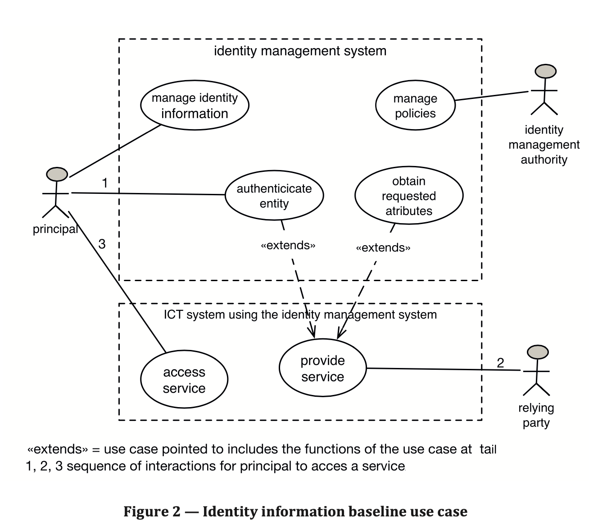
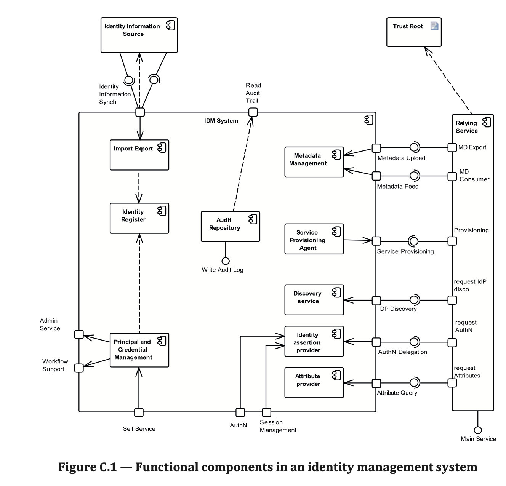

- Articles describing the use of various credentials and their tradeoffs.  These article focuses on credentials, but in some cases the credential and identifier are bundled. Each type described includes benefits and limitations, and common places where you might find the type.

   1. passwords, including notions of entropy/strength, hygiene and additional protections such as lock-out, and protection of central password stores using hashes and salts.  Some user practices that increase risk, such as re-using passwords. 
   3. certificates - how it works, FIDO as an implementation
   4. biometrics - varieties of methods; philosophy - is it an identifier and/or a credential?
   6. passwordless approaches which may use biometrics or certificates, one time use-URLs
   7. One Time Password schemes, TOTP, HOTP, 
   8. Out of band schemes - One time code via eMail, SMS, "push", Discord's session projection scheme, bearer tokens - one time use-URLs

- Articles on Entitlement/Privilege Management aka access control

   1. Introduction. Distinguish Entitlement and Privilege. What entitlements/privileges are; method to protect confidentiality, integrity and even availability of digital assets, and some physical assets such as doors.  
   2. Variations of types of access control mechanisms.  Some systems are simple some complicated.  A list of 5 or 6 examples, including Linux and Windows file systems, bearer token, custom permissions defined at application level,  special sets of permissions in public cloud offerings.
   3. Using levels of risk to select permissions
      1. Static risks
      2. Dynamically determine risk at run time based on context
   6. Useful Models - 
      1. Policy model - PEP etc
      2. Role models
      3. Separation of Duties
      4. Role based 
      5. Policy based
      6. Relationship based - early research
   5. Additional controls to lower risk of HIGHLY privileged users, such as session recording, credential checkout

   7. impersonation - describes the use-cases where one person acting as another make sense and what  added controls may be desired.

- Articles on the considerations regarding Proofing, Binding, and Registration of digital identity
   1. Level of Assurance Model and mapping to risk
   2. Evidence and chain of custody
   3. Creation and delivery of credentials
      1. Self-sovereign credentials (including FIDO style)

- Articles on IAM-related security essentials - needed to understand mechanisms involved in authentication and access control
   1. encryption primer
      1. hashes and cryptographic hashes
      2. symmetric and asymmetric cryptography
      3. keys, key handling, and secret storage
      4. A short history of public key infrastructure (PKI)
   2. Trust boundaries and domains of administration
   3. Logs, monitors and forensics
   4. Risks, Threats and responses
      1. Common ways to evaluate and register risks
      1. Threat modeling
      2. social engineering
      3. common exploitations
      4. vulnerabilities and patches
## Articles on different common IAM architectures

   [ original call from certification cmte: specifically on-premise, hybrid, or cloud-based identity architecture, and the pros and cons of each ]
   [ This appears to be calling for a deeper dive on Technical Architecture - these topics are already covered briefly in the published introduction - GBD to breakdown.]

   These articles are based on the ISO model as an identity management system(IMS) and relying systems which use the IMS.  Based on the following two charts an modelthat is both simplified and extended is shown.  The extension allows authorization and governance can be included. It is simplified to remove the UML fine points, which will be off putting to the typical reader. 

#### Technical Architecture Model

The FIRST article provides the set of components and a restatement/extension of the ISO framing.  A set of connectors is also described at a functional level.  These generic assets will be shown with implementations in the use-cases which follow.

   

   

   

### Technical Use Cases   

The FOLLOWING articles describe a single use-case as implemented in a  particular architecture to illustrate a set of components and how they are connected and interact to perform the use-case.  These articles are group by the functions defined in the FIRST article (things like authentication, provisioning, authorization...)

The use-case articles follow a common structure:
   - Use-case name
   - Architecture Type or types (The styles are described in  "Introduction to IAM Architecture," IDPro Body of Knowledge" article: Host, Client-Server, N-tier, Hub & Spoke, Remote Access, Cloud Environments.  )
   - Short description
   - Actors, components and connectors included (with a diagram).  The components and connectors refer to the abstract architectural components and their implementations in this use-case.
   - Prerequisites
   - Exposition on how the components work together and some level of detail.  In general this describes the external view point.  Internals of the component are minimized.
   - Where to find more information on this and adjacent use-cases

Example: of a use-case.  This example is chosen to indicate how constrained these articles are intended to be.  There could be quite a few variations on Windows login.  

   Name: Employee logs in to Windows domain - Kerberos
   Short Description: Interactive domain login using password (Kerberos)
   Architecture: Client-Server
   Description: An existing employee logs into the corporate Windows environment with a password.
   Actors/Components: User (employee), network attached computer running Windows 10, Microsoft Active Directory (IDENTITY REGISTER),  Kerberos protocol (AUTHENTICATION)

### List of use-cases 

The list of use-case articles is intended to grow over time. [seeded 5/20/21 - discuss with cmte for more]

#### Function: Authentication
1. Employee logs in to Windows domain - Kerberos
1. Customer logs in from web browser - OpenID Connect
1. Cloud service authenticates via delegation - SAML

#### Function: Provisioning
1. Directory absorbs changed people information from HR - LDAP
1. Directory synchronizes with downstream resource - SCIM

#### Function: Attribute Exchange

1. Attributes are provided in assertion - SAML
2. Attributes are requested - OpenID Connect

#### Function: Authorization

1. File system authorizes access - Windows
2. Application authorizes based on attributes - custom
3. Application delegates to policy service - OAuth
4. Cloud service authorizes based on role assumed from single signon - Cloud

   

---

- A single article that describe when, where and how federated identity management is appropriate.  This is not a technical how-to, but establishes whether it makes sense for a use-case.  The "how" portion refers to organzing framework between the domains.
   1. start from the idea of Trust boundaries and domains of administration.  
   2. discuss the use-cases and what problems they are trying to solve
      3. use case 1
      4. use case n 